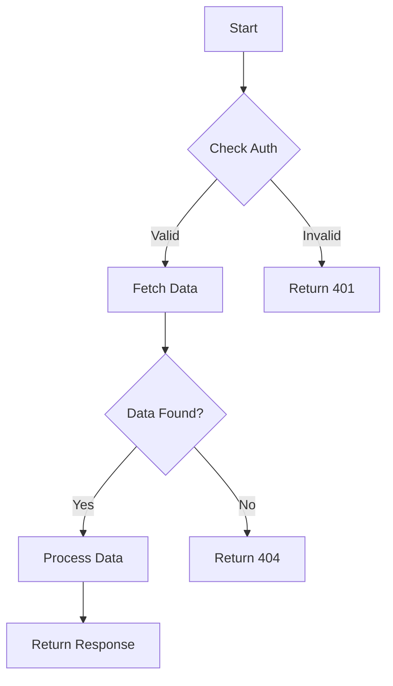
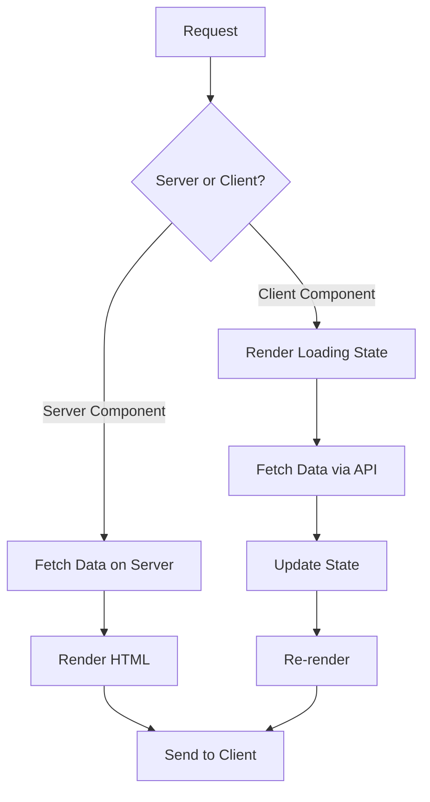
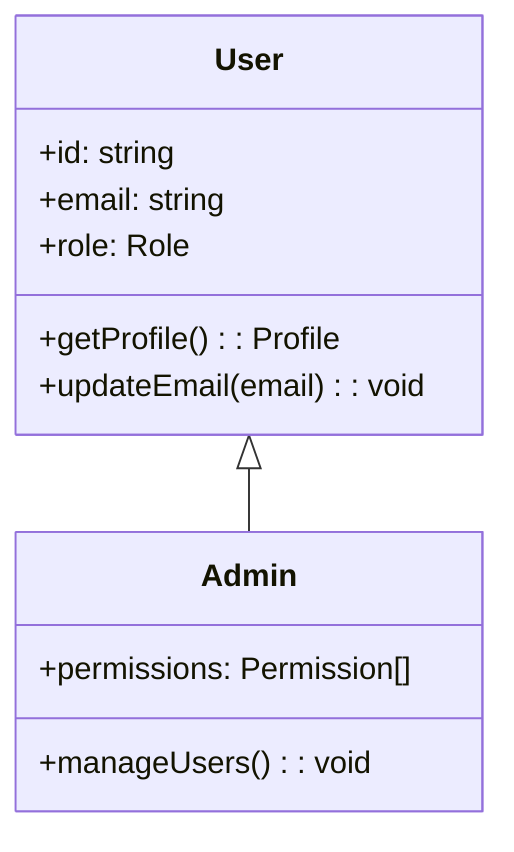
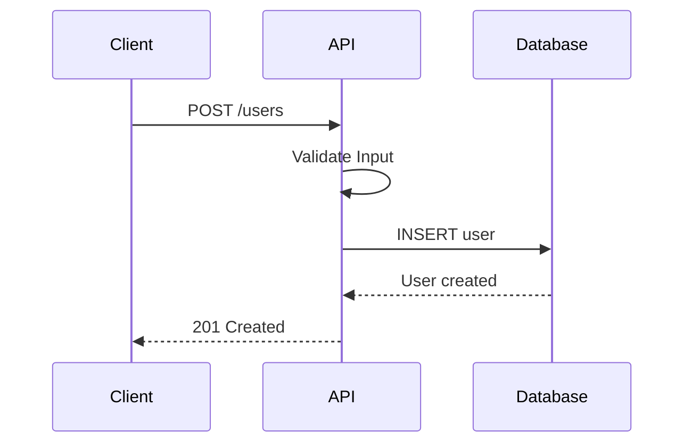

# Code Explanation and Analysis

Explain complex code through clear narratives, visual diagrams, and step-by-step breakdowns.

## Code to Explain

$ARGUMENTS

## Stack Detection

First, detect the code language:
1. Check for `py` or `ts` prefix in the command
2. If no prefix, auto-detect based on syntax or file extension

---

## Explanation Strategy

### 1. High-Level Overview
- What does this code do?
- What problem does it solve?
- What are the key concepts used?

### 2. Step-by-Step Breakdown
- Walk through the code flow
- Explain each significant part
- Highlight important decisions

### 3. Visual Diagrams
- Flow charts for control flow
- Class diagrams for OOP
- Sequence diagrams for interactions

### 4. Practical Examples
- Show input/output examples
- Demonstrate edge cases
- Provide runnable code samples

---

## Python Stack (py)

### Common Concepts to Explain

**Decorators**
```python
# What decorators do:
@timer
def slow_function():
    time.sleep(1)

# Is equivalent to:
def slow_function():
    time.sleep(1)
slow_function = timer(slow_function)

# Decorators wrap functions to add behavior
# without modifying the original function
```

**Context Managers**
```python
# The 'with' statement ensures cleanup
with open('file.txt') as f:
    data = f.read()
# File is automatically closed here

# Custom context manager
class DatabaseConnection:
    def __enter__(self):
        self.conn = connect()
        return self.conn

    def __exit__(self, exc_type, exc_val, exc_tb):
        self.conn.close()
```

**Async/Await**
```python
# Async allows concurrent I/O operations
async def fetch_data():
    # 'await' pauses here until complete
    response = await http_client.get(url)
    return response.json()

# Run multiple operations concurrently
results = await asyncio.gather(
    fetch_data(url1),
    fetch_data(url2),
    fetch_data(url3),
)
# All three requests run at the same time
```

**Generators**
```python
# Generators produce values lazily
def count_up_to(n):
    i = 0
    while i < n:
        yield i  # Produces one value and pauses
        i += 1

# Memory efficient - doesn't create full list
for num in count_up_to(1000000):
    print(num)
```

**Type Hints**
```python
# Type hints document expected types
def process_user(
    user_id: int,
    options: dict[str, Any] | None = None,
) -> User:
    """
    Args:
        user_id: The user's unique identifier
        options: Optional processing options

    Returns:
        The processed User object
    """
    pass
```

### Python Flow Diagram Example



---

## TypeScript Stack (ts)

### Common Concepts to Explain

**TypeScript Generics**
```typescript
// Generics allow type-safe reusable code
function first<T>(arr: T[]): T | undefined {
    return arr[0]
}

// T is inferred from usage
const num = first([1, 2, 3])      // type: number
const str = first(['a', 'b'])    // type: string

// Generic constraints
function getProperty<T, K extends keyof T>(obj: T, key: K): T[K] {
    return obj[key]
}
```

**React Hooks**
```typescript
// useState - manage component state
const [count, setCount] = useState(0)
// count: current value
// setCount: function to update value

// useEffect - side effects
useEffect(() => {
    // Runs after render
    fetchData()

    // Cleanup function (optional)
    return () => cleanup()
}, [dependency]) // Re-runs when dependency changes

// useMemo - cache expensive calculations
const processed = useMemo(
    () => expensiveCalculation(data),
    [data] // Only recalculate when data changes
)
```

**Async/Await in TypeScript**
```typescript
// Async functions return Promises
async function fetchUser(id: string): Promise<User> {
    const response = await fetch(`/api/users/${id}`)

    if (!response.ok) {
        throw new Error('User not found')
    }

    return response.json()
}

// Error handling
try {
    const user = await fetchUser('123')
} catch (error) {
    console.error('Failed to fetch user:', error)
}
```

**Discriminated Unions**
```typescript
// Type-safe handling of different states
type Result<T> =
    | { status: 'loading' }
    | { status: 'success'; data: T }
    | { status: 'error'; error: Error }

function handleResult(result: Result<User>) {
    switch (result.status) {
        case 'loading':
            return <Spinner />
        case 'success':
            return <UserCard user={result.data} />
        case 'error':
            return <Error message={result.error.message} />
    }
}
```

**Next.js Server Components**
```typescript
// Server Component (default in app directory)
// Runs on server, can use async/await directly
async function UserPage({ params }: { params: { id: string } }) {
    const user = await fetchUser(params.id) // Direct DB/API call

    return <UserProfile user={user} />
}

// Client Component (needs 'use client')
'use client'
function InteractiveButton() {
    const [clicked, setClicked] = useState(false)
    // Can use hooks, event handlers, browser APIs
    return <button onClick={() => setClicked(true)}>Click</button>
}
```

### TypeScript Flow Diagram Example



---

## Visual Explanation Formats

### Class Diagram (OOP)


### Sequence Diagram (Interactions)


---

## Output Format

1. **Overview** - What the code does in plain language
2. **Key Concepts** - Programming concepts used
3. **Step-by-Step** - Walkthrough of the code flow
4. **Visual Diagram** - Mermaid diagram if helpful
5. **Examples** - Input/output demonstrations
6. **Common Pitfalls** - What to watch out for
7. **Related Concepts** - Further learning suggestions

Focus on making complex code accessible through clear explanations and practical examples.
